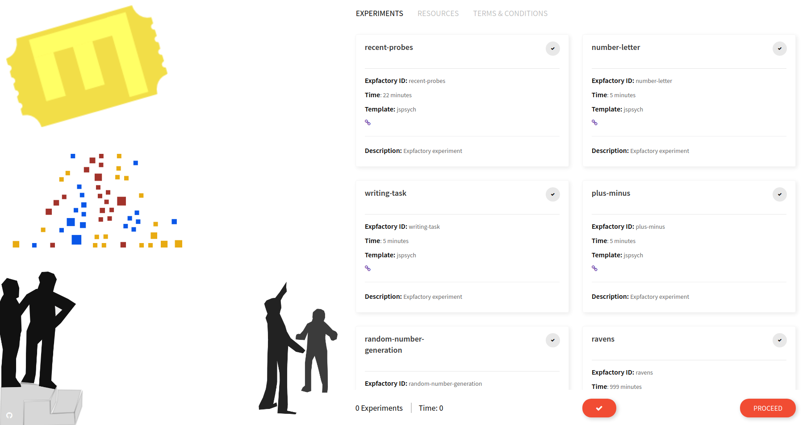

# Summary

The Experiment Factory [@vanessa_sochat_2017_1059119] is Open Source software that makes it easy to generate reproducible behavioral experiments. It offers a browsable, and tested [library](https://expfactory.github.io/experiments/) of experiments, games, and surveys, support for multiple kinds of databases, and [robust documentation](https://expfactory.github.io/expfactory/) for the provided tools. A user interested in deploying a behavioral assessment can simply select a grouping of paradigms from the web interface, and build a container to serve them.

# Challenges with Behavioral Research

The reproducibility crisis [@Ram2013-km, @Stodden2010-cu, @noauthor_2015-ig, @noauthor_undated-sn, @Baker_undated-bx, @Open_Science_Collaboration2015-hb] has been well met by many efforts [@Belmann2015-eb, @Moreews2015-dy, @Boettiger2014-cz, @Santana-Perez2015-wo, @Wandell2015-yt] across scientific disciplines to capture dependencies required for a scientific analysis. Behavioral research is especially challenging, historically due to the need to bring a study participant into the lab, and currently due to needing to develop and validate a well-tested set of paradigms. A common format for these paradigms is a web-based format that can be done on a computer with an internet connection, without one if all resources are provided locally. However, while many great tools exist for creating the web-based paradigms [@De_Leeuw2015-zw, @McDonnell2012-ns], still lacking is assurance that the generated paradigms will be reproducible. Specifically, the following challenges remain:

 - **Dependencies** such as software, experiment static files, and runtime variables must be captured for reproduciblity.
 - Individual experiments and the library must be **version controlled.**
 - Each experiment could benefit from being maintianed and tested in an **Open Source** fashion. This means that those knowledgable about the paradigm can easily collaborate on code, and others can file issues and ask questions.
 - Tools must allow for **flexibility** to allow different libraries (e.g., JavaScript).
 - The final product should be **easy to deploy** exactly as the creator intended.

The early version of the Experiment Factory [@Sochat2016-pu] did a good job to develop somewhat modular paradigms, and offered a small set of Python tools to generate local, static batteries from a single repository. Unfortunately, it was severely limited in its ability to scale, and provide reproducible deployments via linux containers [@Merkel2014-da]. The experiments were required to conform to specific set of software, the lack of containerization meant that installation was challenging and error prone, and importantly, it did not meet the complete set of goals outlined above. While the `expfactory-docker` [@noauthor_undated-pi, @Sochat2016-pu] image offered a means to deploy experiments to Amazon Mechanical Turk, it required substantial setup and was primarily developed to meet the specific needs of one lab.

# Experiment Container Generation
The software outlined here, "expfactory," shares little with the original implementation beyond the name. Specifically, it allows for encapsulation of all dependencies and static files required for behavioral experimentation, and flexibility to the user for configuration of the deployment. For usage of a pre-existing experiment container, the user simply needs to run the Docker image. For generation of a new, custom container the generation workflow is typically the following:
 
 - **Selection** The user browses a [library](https://expfactory.github.io/experiments/) of available experiments, surveys, and games. A preview is available directly in the browser, and data saved to the local machine for inspection. The preview reflects exactly what will be installed into the container.
 - **Generation** The user selects one or more paradigms to add to the container, and clicks "Generate." The user runs the command shown in the browser on his or her local machine to produce the custom recipe for the container, called a Dockerfile.
 - **Building** The user builds the container (and optionally adds the Dockerfile to version control or automated building on Docker Hub) and uses it in production. The same container is then available for others that want to reproduce the experiment.

At runtime, the user is then able to select deployment customization such as database (MySQL, PostgreSQL, sqlite3, or default of filesystem), and a study identifier.

# Experiment Container Usage
Once a container is generated and it's unique identifier and image layers served in a registry like Docker Hub, it can be cited in a paper with confidence that others can run and reproduce the work simply by using it.

More information on experiment development and contribution to the expfactory tools, containers, or library is provided at the Experiment Factory  <a href="https://expfactory.github.io/expfactory/" target="_blank">official documentation</a>. This is an Open Source project, and so <a href="https://www.github.com/expfactory/expfactory/issues" target="_blank">feedback and contributions</a> are encouraged and welcome.

# References
